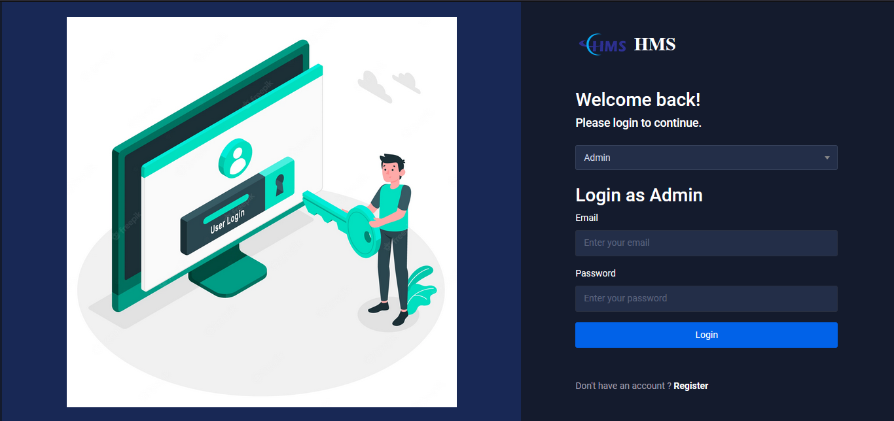
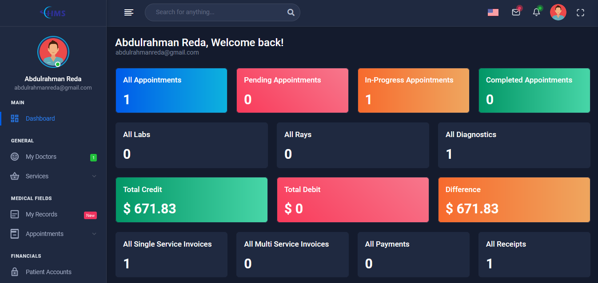

# 🏥 Hospital Management System (Laravel)

A full-featured, multilingual Hospital Management System (HMS) built using Laravel and Livewire. Designed to streamline hospital operations for admins, doctors, lab/ray employees, and patients through one powerful web application.

> 🚀 Developed as my first large-scale Laravel project after months of intense learning and hands-on practice.

---

## 🧠 Key Features

- **User Roles with Dashboards**: Admins, Doctors, Lab Employees, Ray Employees, and Patients.
- **Appointment Management**: Booking, tracking, and managing appointments.
- **Medical Records**: Full history per patient including test results, rays, prescriptions, and invoices.
- **Lab & Radiology Referrals**: Doctors can send and receive lab or ray requests.
- **Invoices & Billing**: Dynamic invoice generation and financial management.
- **Multilingual Support**: English 🇬🇧 and Arabic 🇪🇬 interface.
- **Auth System**: Secure login & registration for each user type.
- **Admin Controls**: Manage departments, users, services, and more.

---

## 📸 Screenshots

| Login Page                                    | Patient Dashboard                                    | Admin Dashboard                                    |
| --------------------------------------------- | ---------------------------------------------------- | -------------------------------------------------- |
|  |  |  |

More screenshots in the [`/public/screenshots`](./public/screenshots) folder.

---

## 📄 PDF Documentation

- [`Key-Features-Showcase.pdf`](./public/pdfs/Key-Features-Showcase.pdf) — 22 pages showing the system’s UI and key use cases.
- [`Project-Overview.pdf`](./public/pdfs/Project-Overview.pdf) — 99 pages full walkthrough with screens and flows.

---

## 🛠️ Tech Stack

- **Backend:** Laravel 10, Livewire
- **Frontend:** Blade, Tailwind CSS, Bootstrap, jQuery
- **Database:** MySQL
- **Multi-language:** Laravel Localization (English / Arabic)
- **Packages:** Spatie, Livewire, etc.

---

## 🚀 Installation

1. Clone the repo:
   ```bash
   git clone https://github.com/ZiadGamalDev/hospital-management-system-laravel.git
   cd hospital-management-system-laravel
   ```

2. Install dependencies:
   ```bash
   composer install
   npm install && npm run dev
   ```

3. Setup environment:
   ```bash
   cp .env.example .env
   php artisan key:generate
   ```

4. Configure your `.env` with your DB credentials.

5. Run migrations & seeders:
   ```bash
   php artisan migrate --seed
   ```

6. Serve the app:
   ```bash
   php artisan serve
   ```

---

## 🔐 Seeded Credentials

Login using these test credentials (auto-seeded):

### Admins
- `admin@gmail.com` / `admin`
- `zyadgamal450@gmail.com` / `password`

### Doctors
- `omargamal@gmail.com` / `password`
- `hamzagamal@gmail.com` / `password`

### Patients
- `abdulrahmanreda@gmail.com` / `password`
- `mostafakhaled@gmail.com` / `password`

### Lab
- `yousefmohamed@gmail.com` / `password`

### Radiology
- `eyadmohamed@gmail.com` / `password`

---

## 💬 Contributions

This project is not currently open for contribution. It's meant to be a personal full-stack showcase, but you're welcome to fork it or learn from it.

---

## 🌐 Live Demo

Check out the live version of the Hospital Management System:

👉 [https://hms.dinamo-app.com](https://hms.dinamo-app.com)

---

## 📣 About Me

I'm **Ziad Gamal**, a passionate backend developer focused on Laravel and MERN stack. This project is the result of 3 months of non-stop learning and building — and I’m proud to share it as part of my portfolio.

**Let’s connect on [LinkedIn](https://www.linkedin.com/in/ziad-gamal/)**
